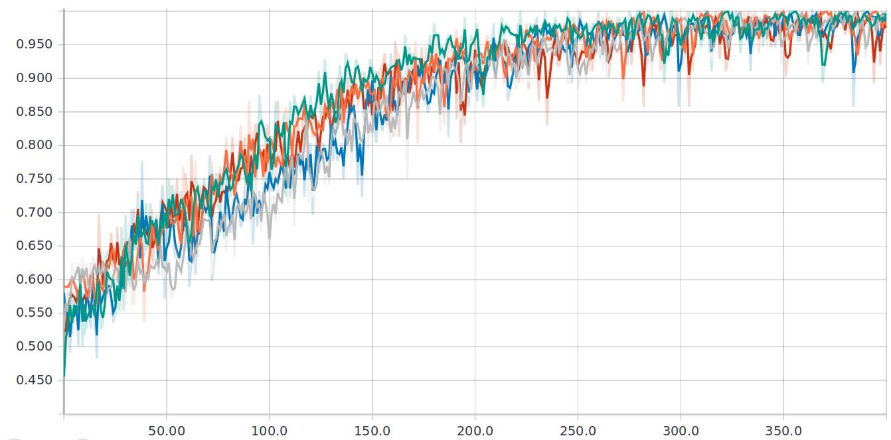
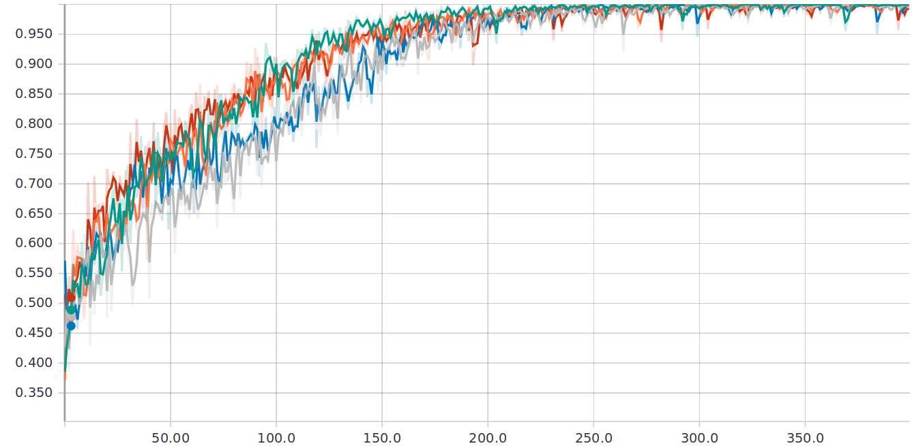
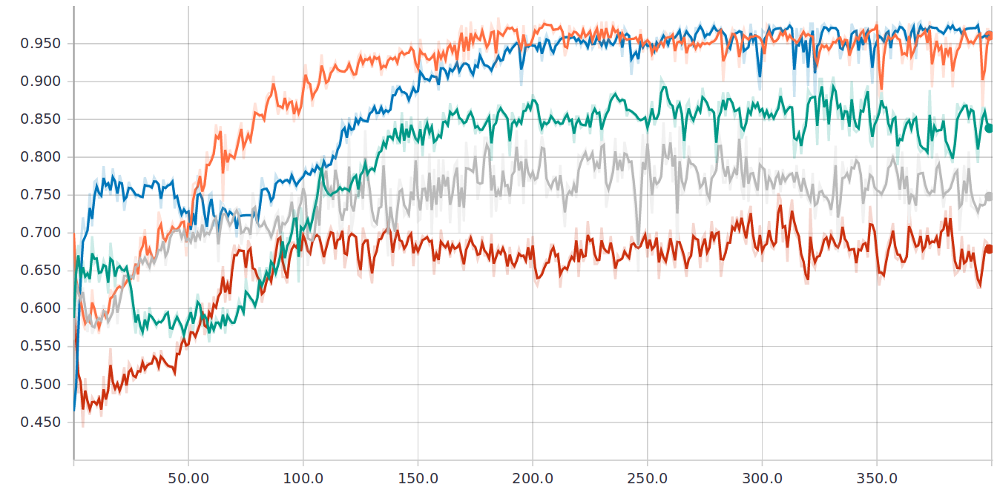

# Tuberculosis diagnosis with a CNN

This repo contains the implementation of the convolutional neural network
for tuberculosis diagnosis described in [paper is coming, hepefully :-)],
which I will call tbcnn for short. The network uses frontal chest X-Rays
images as input.

## Requirements

To run it properly:

 * 8 GB of RAM.
 * A nvdia GPU with cuda support (even a cheap one).

Training on CPU will be *very* slow.

## Get it to work

First clone the repo to your preferred location:

```bash
git clone https://github.com/frapa/tbcnn.git
```

We then need to install the dependencies. The network depends on (assuming python3):

```bash
# CUDA and CUDNN: install according to your platform. For ubuntu:
sudo apt-key adv --fetch-keys http://developer.download.nvidia.com/compute/cuda/repos/ubuntu1604/x86_64/7fa2af80.pub
wget http://developer.download.nvidia.com/compute/cuda/repos/ubuntu1604/x86_64/cuda-repo-ubuntu1604_9.1.85-1_amd64.deb
sudo apt install ./cuda-repo-ubuntu1604_9.1.85-1_amd64.deb
wget http://developer.download.nvidia.com/compute/machine-learning/repos/ubuntu1604/x86_64/nvidia-machine-learning-repo-ubuntu1604_1.0.0-1_amd64.deb
sudo apt install ./nvidia-machine-learning-repo-ubuntu1604_1.0.0-1_amd64.deb
sudo apt update

# Install CUDA and tools. Include optional NCCL 2.x
sudo apt install cuda9.0 cuda-cublas-9-0 cuda-cufft-9-0 cuda-curand-9-0 \
    cuda-cusolver-9-0 cuda-cusparse-9-0 libcudnn7=7.2.1.38-1+cuda9.0 \
    libnccl2=2.2.13-1+cuda9.0 cuda-command-line-tools-9-0

# tensorflow
# CPU only (training will take forever, like 1/2 hour per epoch)
pip3 install --user tensorflow
# you need a nvidia GPU with CUDA support
pip3 install --user tensorflow-gpu

# numpy
pip3 install --user numpy

# scipy
pip3 install --user scipy

# skimage
pip3 install --user skimage

# SimpleITK
pip3 install --user SimpleITK

# tensorboard for real time visualization
pip3 install --user tensorboard
```

Once we have installed the needed dependencies, we need to download the
data to train the network on. You can get some from the NIH public dataset
[here](https://ceb.nlm.nih.gov/repositories/tuberculosis-chest-x-ray-image-data-sets/).
You can for example download the Montgomery dataset, open the zip and copy the
image files into the `data` directory. Another approach that I prefer is making
a directory `montgomery` copying the images into it and create a symlink called data
to this directory, as it makes swapping the database very easy:

```bash
ln -rs montgomery data
```

Then you can run the network running simply

```bash
python3 train.py
```

If you want to run a cross-validation study (5-fold), you can run:

```bash
python3 train.py --cross-validation
```

You can also open tensorboard at http://localhost:6006 to check graphs the reporting
training and test accuracy and AUC in real time.

There are no other options apart from these two, but the source code is
well commented and should be easy to play around with.

## About the implementation

The network is written in tensorflow. Training steps:

1. The first time you run the script, the images in the `data` folder will be
preprocessed (cropped and scaled) and cached to a `preprocessed` directory.
If you change the data, you also need to delete the `preprocessed` folder, 
otherwise it will still use the old data.
2. After preprocessing the images, the input data is "prepared" which means that
it is converted to `float32` with zero mean and unit standard deviation and is then
cached to multiple `input*.npy` files to be easily loaded at training time. As with
preprocessing, you need to delete the `input*.npy` files after changing the data
for the new data to be used.
3. The implementation makes use of the tensorflow Dataset API, to parallelize
augmentation on multiple CPU cores and training on the GPU.
4. The Elastic deformation augmentation is implemented using SimpleITK which as
far as I know is the only public implementation around.

## Results

I report here some training results for comparison. I trained on a
GTX 1050 Ti with 4 GB of memory, while using 8 GB of main memory and
an old quad-code i5.

### Montgomery dataset

These are the results of a 5-fold cross-validation study on the
Montgomery dataset.

|Run|Epochs|Time|Test accuracy|Test AUC|
|---|---|---|---|---|
|1|400|35min|0.7500|0.8333|
|2|400|35min|0.5714|0.7487|
|3|400|35min|0.9286|0.9692|
|4|400|35min|0.8519|0.9618|
|5|400|35min|0.7037|0.6761|
|Cross-validation||2h 55min|0.7611|0.8378|

#### Training accuracy


#### Training AUC


#### Test accuracy


#### Test AUC
